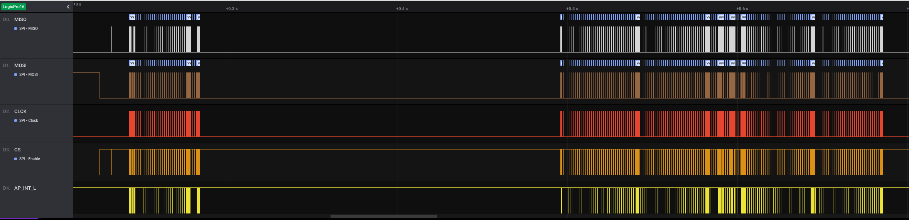
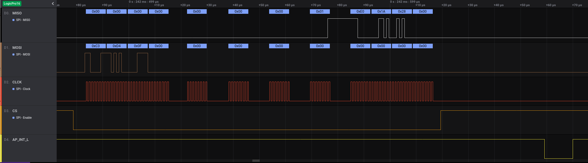
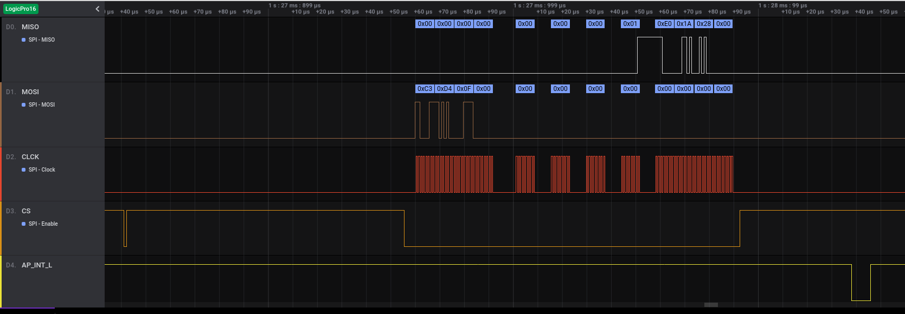

# Cr50 And Chrome OS Verified Boot Troubleshooting

H1 is a Google security chip installed on most Chrome OS devices. Cr50 is the
firmware running on the H1. A high level overview of hardware and firmware can
be found in [this
presentation](https://2018.osfc.io/uploads/talk/paper/7/gsc_copy.pdf).

This write-up is an attempt to explain how Cr50 participates in the Chrome OS
device boot process, and what are possible reasons for the dreaded "Chrome OS
Missing Or Damaged" screen showing up when Chrome OS device reboots.

## Basic overview

The H1 controls reset lines of the EC (embedded controller) and the AP
(application processor, or SOC). During normal Chromebook operation H1 is
always powered up as long as battery retains even a minimal amount of charge.
In Chromeboxes H1 powers on with the rest of the system.

One of the important functions of H1 in the system is a subset of TPM (Trusted
Platform Module) functionality. The TPM stores verified boot information, this
is why any **problems communicating with the TPM during the boot up process**
result in the Chrome OS device falling into **recovery mode**.

Another important function of the H1 in the system is CCD ([closed case
debugging](https://chromium.googlesource.com/chromiumos/platform/ec/+/fe6ca90e/docs/case_closed_debugging_cr50.md#))

## H1 power states and CCD

During periods of inactivity H1 could enter a *sleep* or *deep sleep* state.
In *sleep* state most of the clocks are turned off and power consumption is
minimized, but SRAM contents and the CPU state are maintained. In *deep sleep*
state the H1 is practically shut down.

The H1 never enters the *deep sleep* state during the Chrome OS boot process,
but could enter the *sleep* state if the Chrome OS device boot process is
delayed for whatever reason, and **only when CCD is not active**. This could
be one of the reasons that there are boot failures when CCD is not connected,
but the failures go away if CCD is on (the debug cable is plugged in).

To make sure the H1 exits the *sleep* state the AP triggers a wake up event,
details of which are described below.

## H1 communications with the AP

The H1 could be connected to the AP over the I2C or SPI bus. The same Cr50
firmware is used in both cases, the decision which of the two interfaces to
use is made based on resistor straps the Cr50 reads at startup.

Both I2C and SPI interfaces do not fully comply with their respective bus
standards: the I2C controller does not support clock stretching, and the SPI
controller can not be clocked faster than 2 MHz.

Look for a text line like the following in the Cr50 console output right after
power up

> [0.005657 Valid strap: 0xa properties: 0x41]

to confirm that the straps were read properly.

A Cr50 console command allows to see which interface is used to communicate
with the AP:

> \> brdpprop 
> properties = 0x1141

If the least significant bit of the value is set, the H1 is using the SPI
interface, if the bit is cleared the H1 is using the I2C interface.

Using H1 imposes additional requirements on the AP interface - the H1 might
have to be waken up from sleep, and flow controls the AP using an additional
`AP_INT_L` signal, both described in more details below.

## TPM reset

The H1 is staying up until power is removed, unless it falls into deep sleep.
TPM is just one of the components of the Cr50 firmware, and the TPM must be
reset when the AP resets.

There are differences between ARM and X86 reset circuit architectures. ARM
SOCs have a bidirectional reset signal called `SYS_RST_L`. They (or, rather,
most of them, but let's not worry about the outliers) generate a pulse on this
line when the SOC reboots. External device can toggle this line to reset the
SOC asynchronously, which is what the Cr50 does to reset ARM SOCs.

The X86 SOCs have two separate signals, one output `PLT_RST_L` which is held
low, while the AP is in reset or in low power mode, and one input,
`SYS_RST_ODL` which Cr50 toggles to reset the SOC.

In case of X86, when `PLT_RST_L` is held low longer than a second, the Cr50
considers this an indication of the AP going into a low power mode (S5 or
lower), which means that the AP will start from the reset vector when it wakes
up, so Cr50 can take H1 into *deep sleep* mode as well.

On top of that ARM based Chrome OS devices have some additional logic which
forces the `SYS_RST_L` behave similar to `PLT_RST_L` - it stays low when
the SOC is in a low power mode and will resume operation from the reset
vector. This allows H1 to enter deep sleep on ARM devices as well.

Resistor bootstraps tell the Cr50 which kind of reset architecture to expect,
the SOC reset indication is used both to reset the TPM component and to enter
the *deep sleep* mode as appropriate.

In the `brdprop` command output bit D5 when set signifies `SYS_RST_L`
('regular' ARM devices) and bit D6 - `PLT_RST_L` (X86 and modified ARM) type
of reset.

Boot problems can arise when the AP reboots, without cr50 seeing a pulse on
the `SYS_RST_L` or `PLT_RST_L` signal: in this case the very first TPM_Startup
command sent by coreboot returns an error, and the Chrome OS device falls into
recovery mode.

## Cr50 operations synchronization

The H1 microcontroller is very slow (clocked at 24 MHz), the AP is usually
hundreds of times faster, there is a need to slow down the AP when it tries to
talk to the TPM during boot up process. The issue is complicated by the
inability of the I2C controller of stretching the clock.

In both I2C and SPI modes the AP\_INT\_L H1 output signal is used to indicate
to the AP that the H1 is ready for the next I2C or SPI transaction. By default
this signal is a 4+ us long low pulse. Some X86 platforms require a pulse of
100+ us, this pulse extension mode can be configured by setting a bit in a TPM
register (I2C register address 0x1c or SPI register address 0xfe0).

In any case it is important that the AP firmware is properly configuring the
pin where the AP\_INT\_L signal is connected as an edge sensitive GPIO, which
latches on either falling or rising edge of the signal.

AP firmware missing these synchronization pulses results in boot process
taking very long time and the AP firmware log including messages

> Timeout wait for TPM IRQ!

in case of SPI or

> Cr50 i2c TPM IRQ timeout!

in case of I2C.

## Waking H1 up from sleep

The I2C Start sequence is sufficient for the H1 to resume operation, the AP
does not have to do anything special. In case of SPI the matters are more
complicated.

Technically speaking the assertion of the CS SPI bus signal is enough to wake
up the H1, but it takes time for it to become fully operational, the AP could
be already transmitting the message by the time the H1 SPI controller is
ready. This is why in case the previous SPI transaction was a second or more
ago, the SPI driver is required to first issue a CS pulse without transferring
any data, just to wake up the H1, then wait for 100 us to let the H1 wake up,
and then continue with a regular SPI transaction.

If the AP does not follow this protocol and starts transmitting before H1 is
ready, communications failures are likely, resulting in the Chrome OS device
falling into recovery. This often happens when the device took a long time to
find the kernel to boot, and then the AP is trying to lock the TPM state
before starting up the kernel, but fails, because the H1 was asleep by this
time and was not properly woken up.

## SPI Message Synchronization

SPI interface is synchronous, and either read or write accesses happen within
a single transaction. The Trusted Computing Group (TCG) came up with a
hardware protocol on top of SPI specification to allow the slow device to flow
control the fast host controller.

The base idea is that each time the AP wants to read or write a TPM register,
it sends a SPI packet, which consists of the header and data fields.

The header field is always present, it is 4 bytes in size, and includes the
operation type (read or write), data length and register address.

The header is sent out as soon as the SPI transaction starts, then the AP
starts monitoring the MOSI line, one byte at a time, paying attention to bit
D0. The Cr50 keeps sending zeros on that bit, until ready to proceed with the
operation requested in the transaction header. Once the Cr50 is ready, it
responds with a byte with bit D0 set to one. At this point the AP knows that
starting with the next byte the actual data of the transaction can be flowing,
so it either sends the data in case of write or reads it from the TPM in case
of reads.

This is described in details in [TCG PC Client Platform TPM Profile (PTP)
Specification Family "2.0" Level 00 Revision
00.43](https://drive.google.com/file/d/16r1vDhf1fnggI4BkOBuTXPqOQt4LaFvk/view?usp=sharing)
in section "6.4 Spi Hardware Protocol".

The AP ignoring this flow control mechanism is yet another common problem
causing failures to boot, because the driver starts sending or receiving data
before TPM is ready. This failure is more likely to happen when developing new
SPI drivers.

## Boot up process examples

A trace of a typical Chrome OS device boot process was collected using the
[Saleae](https://www.saleae.com/) Logic Pro 16 logic analyzer.

The [full trace](./images/bobba_boot.sal) can be examined in details using the
Saleae application in the trace analysis mode.

A few detailed snapshots of this trace are shown below (click to expand):

### Full boot sequence
 shows communications between AP
an H1 during a typical Chrome OS boot: first a flurry of communications
between Coreboot and the H1, then some time spent verifying and loading
various firmware stages, then a block of communications between Depthcarge and
the H1.

### Typical read sequence
 shows the 4 byte header
where the read of four bytes from register address 0xd40f00 is requested. The
TPM is not ready and sends all zeros on the MISO line for three cycles, then
sends a byte of 01 and then the AP reads four bytes of the actual register
value (0xe01a2800). Then, after H1 is ready to accept the next SPI transaction
it generates a pulse on AP\_INT\_L.

### Read with wake pulse sequence
 is an example of a
case where the AP toggles the CS line first, without sending any data, and
then in 100 us starts the actual SPI transaction completed with the AP\_INT\_L
pulse.
