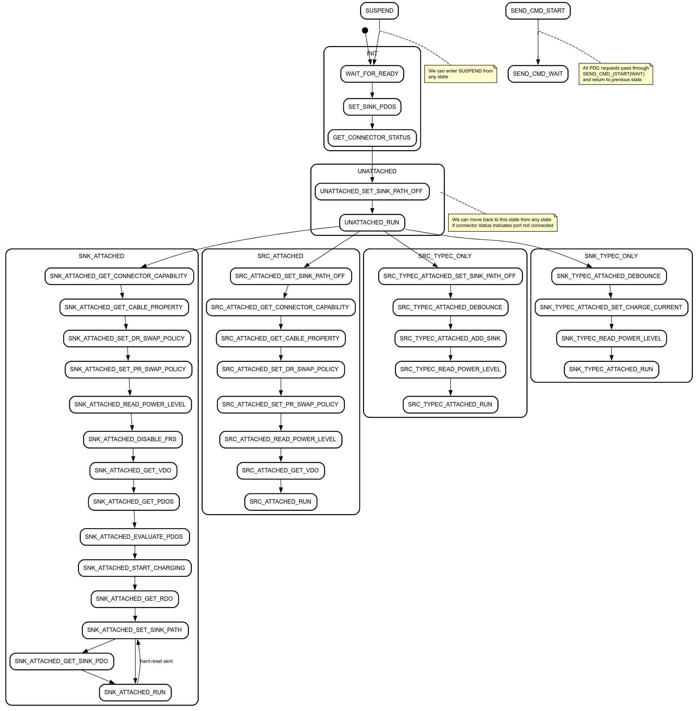

# Zephyr EC PDC Architecture

[TOC]

## Overview
TODO(b/384517822) - Document EC PDC Architecture

## PDC Console Commands
See [zephyr/subsys/pd_controller/pdc_console.c](https://chromium.googlesource.com/chromiumos/platform/ec/+/main/zephyr/subsys/pd_controller/pdc_console.c)

## PDC Driver API
See [zephyr/include/drivers/pdc.h](https://chromium.googlesource.com/chromiumos/platform/ec/+/main/zephyr/include/drivers/pdc.h)

### Supported drivers
See [zephyr/drivers/usbc/](https://chromium.googlesource.com/chromiumos/platform/ec/+/main/zephyr/drivers/usbc/)

## Power Management
[zephyr/subsys/pd_controller/pdc_power_mgmt.c](https://chromium.googlesource.com/chromiumos/platform/ec/+/main/zephyr/subsys/pd_controller/pdc_power_mgmt.c)

### State Machine Diagram

